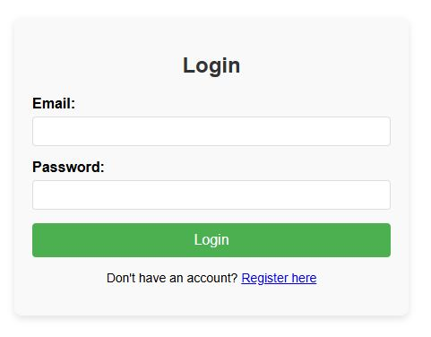
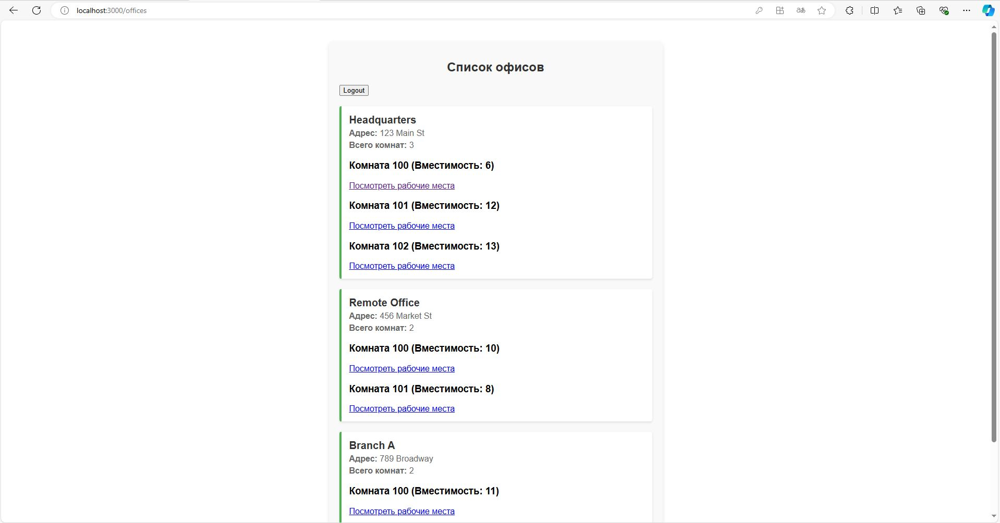
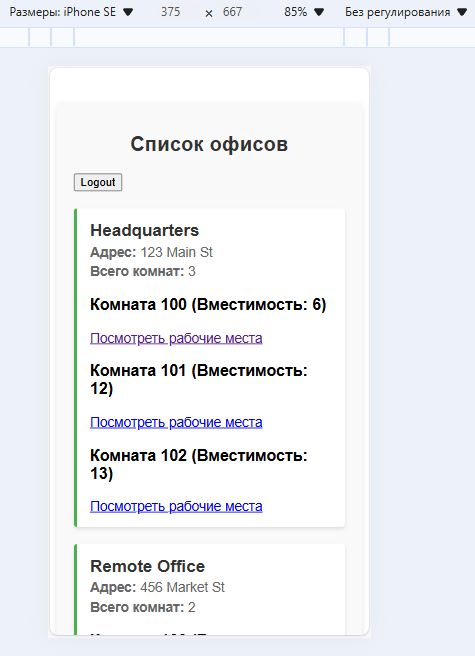
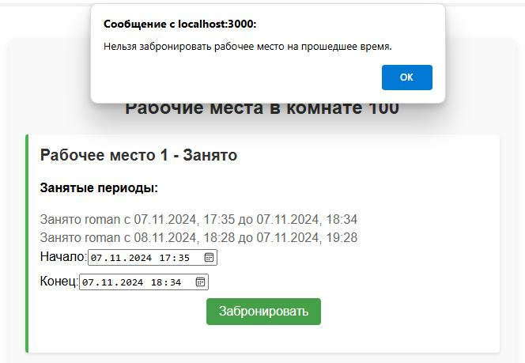
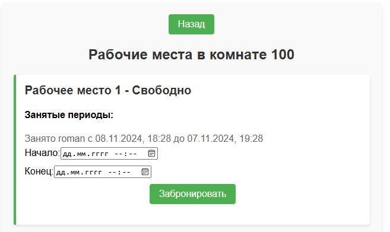
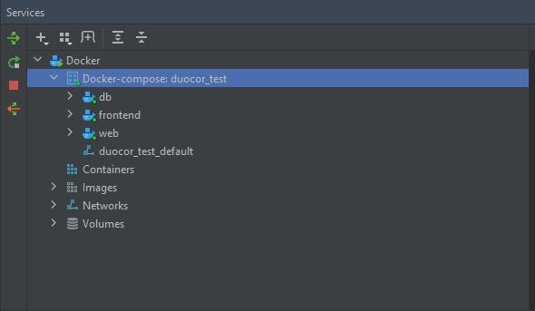

# Тестовое задание Fullstack-разработчик DuoCor

Требуется написать фронт (React) и бэк (Django Rest Framework) для сайта, описанного ниже.
Итоговое приложение нужно упаковать в докер. В контейнеризированной версии приложении обязательно
должна быть база данных PostgreSQL вместо базовой SQLite для django.

Полный запуск приложения должен происходить при выполнении команды docker compose up -d в корневой
папке проекта. Допускается альтернативный запуск (например, с помощью скрипта). Но в таком случае
информацию о запуске проекта нужно прописать в файле README.

В проекте обязательно должна быть демонстрационная копия базы данных, которая автоматически
накатывается при развёртывании приложения через докер. Пароли для аккаунта администратора
обязательно должны быть в файле README.

Любую другую необходимую информацию для проверяющего можно поместить в файл README в корне проекта.

Приложение будет проверяться в браузере Google Chrome последней версии как на десктопе, так и на
мобильном устройстве. Не забудьте продумать адаптив.

Если в данном описании окажется недостаточно информации для реализации проекта, то в таком случае
кандидат может принять необходимое решение по реализации самостоятельно. Важно качество и удобство
финального продукта для конечного пользователя.

Чистота кода тоже будет оцениваться, но это только второй приоритет после удобства приложения для
пользователя.

Комментарии в коде очень приветствуются.

Любая документация, которая облегчит проверку вашего проекта, будет большим плюсом и преимуществом.

Техническое задание:

Надо сделать сайт для управления офисами.

Допустим, у нас есть офисы по разным адресам, там есть комнаты с разными номерами и кол-вом мест.

Хочется иметь сайт, в котором:
1). Можно было бы посмотреть сколько мест свободно и занято в каждой комнате каждого офиса в данный
момент времени.
2). Можно было бы узнать, когда освободится конкретное рабочее место и когда займется какое-то
свободное. Например, место #21 свободно до 17:00, а место #87 занято до 18:00 (а сейчас, допустим,
13:00). Необходимо отображать, кто занимает или займет рабочее место.
3). Можно было бы забронировать свободное рабочее место на определённый временной промежуток. При
этом нужно отслеживать конфликты. Например, место #23 будет занято с 15:00 до 16:00, а я хочу
занять это место с 14:00 до 15:30. Приложение не должно мне позволить это сделать.
4). Для брони нужно реализовать систему аутентификации в приложении. Вход в аккаунт должен
осуществляться по email и паролю. Без входа никакая бизнес-логика не должна быть доступна.
5). Требуется реализовать админку, в которой доступ будет только для администратора. В админке
должна быть возможность редактирования таблицы пользователей, а также должна быть возможность
редактирования офисов, комнат в них и количества рабочих мест в каждой комнате. Так как способов
реализации админки большое количество, требуется прописать в README, как в нее попадать. Аккаунт
администратора должен быть готов сразу после развертывания приложения.

Углублять описанный функционал можно на свое усмотрение. Это определенно будет преимуществом при
оценивании. Например, можно сделать просмотр занятых мест не в данный момент времени, а в любой
указанный пользователем момент. Или в целом реализовать график, на котором в виде промежутков будут
отмечены, когда места заняты, а когда нет. Но это не является приоритетом.

Срок: 5 рабочих дней с момента выдачи задания

Как сдавать работу:
Письмо с работой нужно отправить на почту dev-review@duocor.ru
К письму прикрепите файл с вашим резюме и архив с проектом, в теле письма укажите затраченное время
на работу, а также оставьте ссылку на git-репозиторий с вашим проектом. 

# Решение

Описание проекта: Это приложение для управления офисами, позволяющее бронировать рабочие места в офисах.

## Установка и запуск проекта

Следуйте инструкциям ниже, чтобы скачать проект и запустить приложение.

### Шаг 1: Клонирование репозитория

Сначала клонируйте репозиторий на свой компьютер. В командной строке выполните следующую команду:

```bash
git clone https://github.com/RomanKostikov/DuoCor_test.git
cd DuoCor_test
```

### Шаг 2: Отредактируйте свой файл `.env`

Создайте свой .env(в корне проекта) и заполните его данными из файла env(можно изменить на свои данные)

### Шаг 3: Запуск приложения

Запустите свой проект с помощью следующей команды:

```bash
docker-compose up -d
```

Приложение доступно по адресу `http://localhost:3000/`

### Шаг 4: Ручная установка react-scripts

Если появляется ошибка при запуске react-scripts, выполните следующую команду:

Подключитесь к контейнеру в интерактивном режиме для установки react-scripts:

Запустите контейнер с доступом к командной оболочке для ручной установки:
```bash
docker-compose run frontend sh
```

Очистите кэш npm и переустановите пакеты:

Введите следующую команду для очистки кэша npm и повторной установки всех зависимостей:

```bash
npm cache clean --force
rm -rf node_modules
```

```bash
npm install
```

Используйте относительный путь для запуска:

Попробуйте запустить react-scripts напрямую, указав путь до него:

```bash
./node_modules/.bin/react-scripts start
```
После этого можете удалить старый контейнер с фронтендом и перезапустить сервисы:

```bash
docker-compose down
docker-compose up -d
```

## Проделанная работа

Основной используемы стек: Python, Django, PostgreSQL, Docker, React

Наше приложение для управления офисными рабочими местами предоставляет следующие функциональные возможности:

1. Просмотр доступности рабочих мест
В каждом офисе и каждой комнате можно в реальном времени видеть, какие рабочие места свободны, а 
какие заняты. Это позволяет пользователям легко находить доступные места для бронирования.
2. Информация о времени освобождения и занятии рабочего места
Пользователи могут узнать, когда освободится конкретное рабочее место и когда будет занято 
следующее свободное. Например, можно увидеть, что место #21 свободно до 17:00, а место #87 занято 
до 18:00 (при текущем времени 13:00). Также приложение отображает информацию о том, кто занимает 
рабочее место и кто его займет в будущем.
3. Бронирование рабочего места с проверкой на конфликты
Пользователи могут забронировать свободное рабочее место на определенный временной промежуток. 
Приложение проверяет возможные конфликты при бронировании и предотвращает их. Например, если 
место #23 будет занято с 15:00 до 16:00, пользователь не сможет забронировать его с 14:00 до 15:30, 
так как это пересекается с уже существующей бронью.
4. Система аутентификации
Для бронирования рабочих мест реализована система аутентификации. Вход в аккаунт осуществляется по 
email и паролю. Без входа в аккаунт пользователь не может получить доступ к бизнес-логике 
приложения и возможностям бронирования. Это обеспечивает безопасность и конфиденциальность.
5. Админ-панель для управления приложением
Приложение включает административную панель, доступную только для администратора. В админке можно 
редактировать информацию о пользователях, управлять офисами, комнатами и количеством рабочих мест в 
каждой комнате. После развертывания приложения учетная запись администратора создается 
автоматически, и доступ в админку осуществляется через URL http://localhost:8000/admin. 
Логин: admin, пароль: live5913

Эти функции делают приложение удобным и полезным для управления офисными рабочими местами, 
позволяя пользователям быстро находить свободные места, планировать бронирования и администрировать 
рабочие пространства.

### Скриншоты

Без регистрации/авторизации к бизнес-логике нет доступа:



Приложение кроссплатформенно:





Конфликты бронирования учтены:



Можно вносить изменения из админ панели:




Все упаковано в контейнеры:



P.S. Спасибо за внимание!